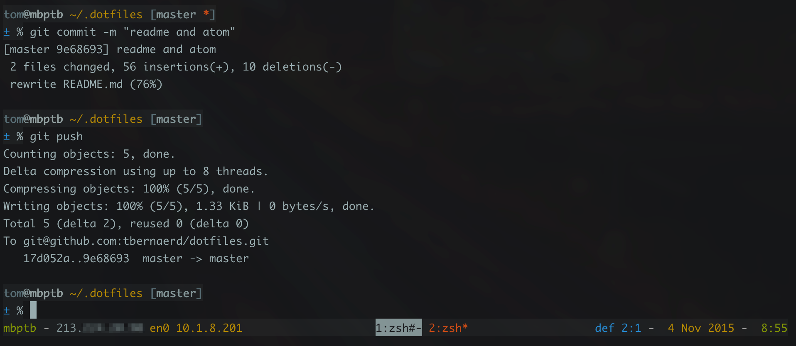

# My dotfiles

I stole most of it elsewhere, mostly from:

* [Zach Holman](https://github.com/holman/dotfiles)
* [Mathias Bynens](https://github.com/mathiasbynens/dotfiles)
* [Bert _devops_ Pattyn](https://github.com/dextro/dotfiles)


## How it works

### Install

Run this:

```
git clone https://github.com/tbernaerd/dotfiles.git ~/.dotfiles
cd ~/.dotfiles
installer/bootstrap
```

This will symlink the appropriate files in `.dotfiles` to your home directory.
Everything is configured and tweaked within `~/.dotfiles`.

The main file you'll want to change right off the bat is `zsh/zshrc.symlink`,
which sets up a few paths that'll be different on your particular machine.

### topical

Everything's built around topic areas. If you're adding a new area to your
forked dotfiles — say, "Java" — you can simply add a `java` directory and put
files in there. Anything with an extension of `.zsh` will get automatically
included into your shell. Anything with an extension of `.symlink` will get
symlinked without extension into `$HOME` when you run `script/bootstrap`.

## What it looks like

My prompt and ZSH config looks like this:



* username and hostname, current directory, git branch, and change indicator
